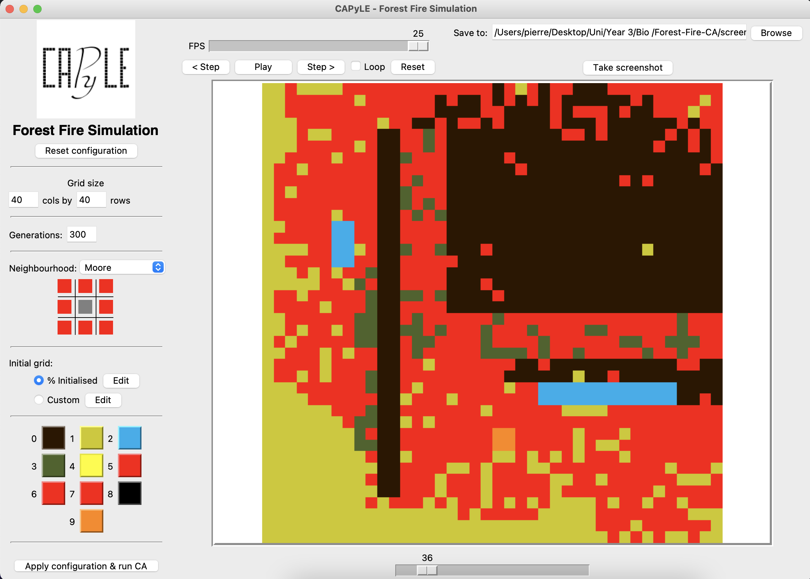

# CAPyLE
CAPyLE is a cross-platform teaching tool designed and built as part of a final year computer science project. It aims to aid the teaching of cellular automata and how they can be used to model natural systems.

It is written completely in python with minimal dependencies.

## Installation
The installation guide can be found on the [CAPyLE webpages](http://pjworsley.github.io/capyle/installationguide.html)

## General Usage
Detailed usage can be found on the [CAPyLE webpages](http://pjworsley.github.io/capyle/).

See below for a quickstart guide:

1. `git clone https://github.com/pjworsley/capyle.git [target-directory]`
2. `cd [target-directory]`
3. Execute main.py either by:
    * `run.bat` / `run.sh`
    * `python main.py`
2. Use the menu bar to select File -> Open. This will open in the folder `./ca_descriptions`.
3. Open one of the example files;
  - `wolframs_1d.py` is Wolfram's elementary 1D automata
  - `gol_2d.py` is Conway's 2D game of life
4. The main GUI elements will now load, feel free to customise the CA parameters on the left hand panel
5. Run the CA with your parameters by clicking the bottom left button 'Apply configuration & run CA'
6. The progress bar will appear as the CA is run
7. After the CA has been run, use the playback controls at the top and the slider at the bottom to run through the simulation.
8. You may save an image of the currently displayed output using the 'Take screenshot' button

## Forest Fire Celluar Automata

After applying your custom parameters click the bottom left button 'Apply configuration & run CA' to run the simulation.

See below on the parameters you can change:
1. Change map layout (The Grid)
    - Modified using the grid variable (line 188).
    - The available states are as follows: 0 = Burnt, 1 = Chaparral, 2 = Lake, 3 = Dense Forest, 4 = Canyon, 5 = Chaparral-Burning, 6 = Dense Forest-Burning, 7 = Canyon-Burning, 8 = Town, 9 = Town Burning.
2. The wind direction
    - Modified using the wind_direction variable (line 63).
    - The available wind directions are: NW,N,NE,E,SE,S,SW,W.
3. The wind speed
    - Modifield using the WIND_FACTOR variable (line 33).
    - The available range is from 0 to 1.
4. The season
    - Modfield using the SEASON variable (line 34).
    - The available options are: summer, winter, autumn, spring and none.
5. The starting location of the fire
    - Power Plant is line 82.
    - Incinerator is line 87.
6. The fuel for each material
    - Modified using the fuel dictionary (line 62)
7. The base probability of catching fire for each material
    - Canyon: Modified using canyon_probability (line 110)
    - Chaparral: Modified using chaparral_cells_probability (line 120)
    - Dense Forest: Modified using Forest (line 130)
    - Town: Modified using town_probability (line 141)
8. Grid size
    - Modified using variable sf (line 290)

  
## Acknowledgements
Special thanks to [Dr Dawn Walker](http://staffwww.dcs.shef.ac.uk/people/D.Walker/) for proposing and supervising this project.

Also thanks to the COM2005 2016/2017 cohort for being the guinea-pigs!

## Licence
CAPyLE is licensed under a BSD licence, the terms of which can be found in the LICENCE file.

Copyright 2017 Peter Worsley
